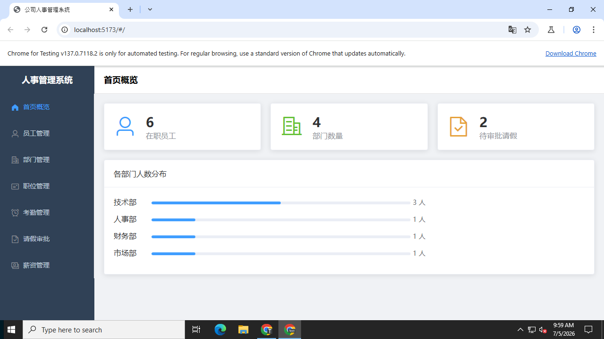
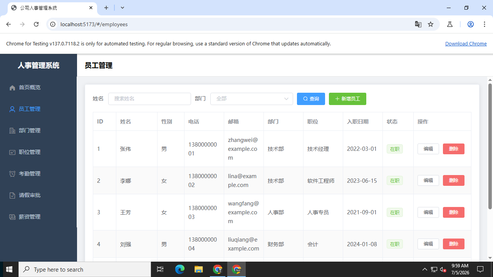
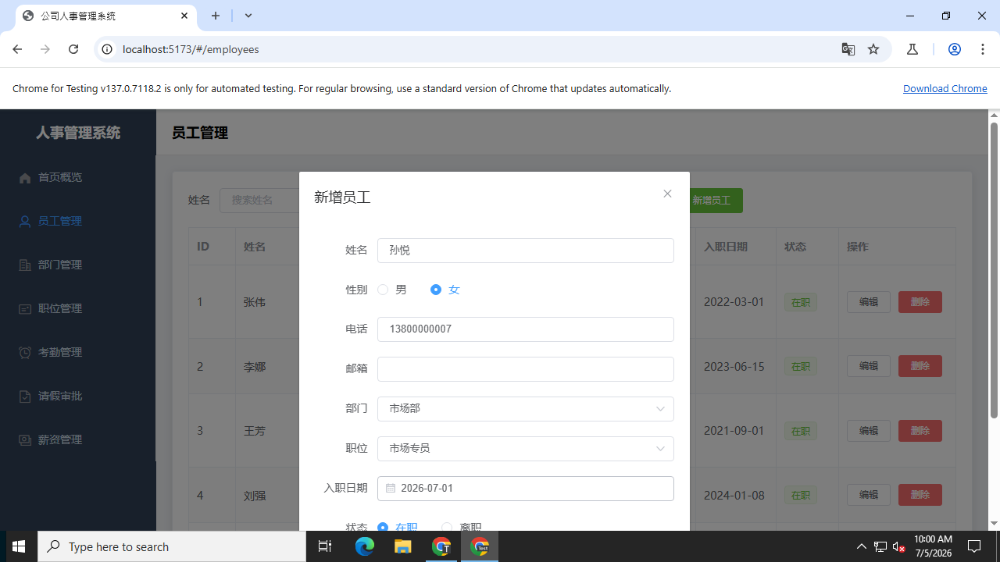
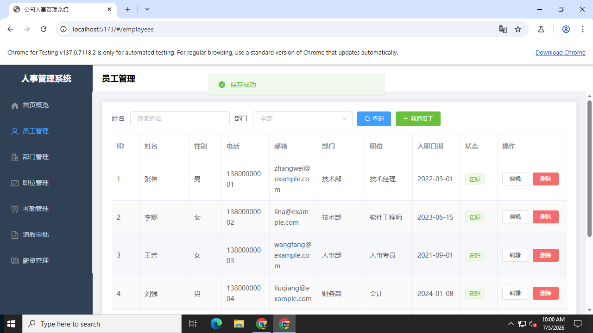
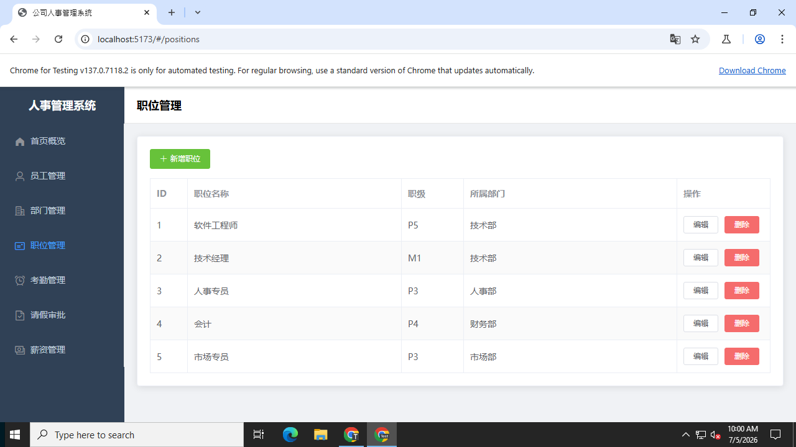
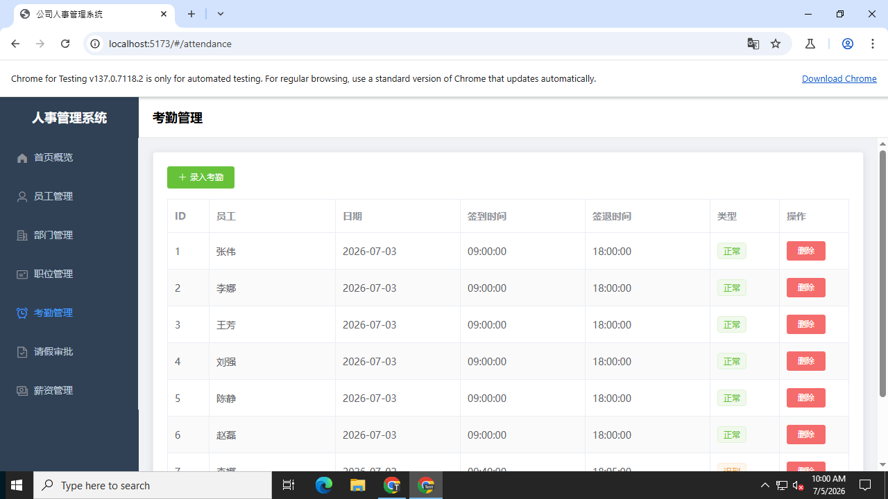
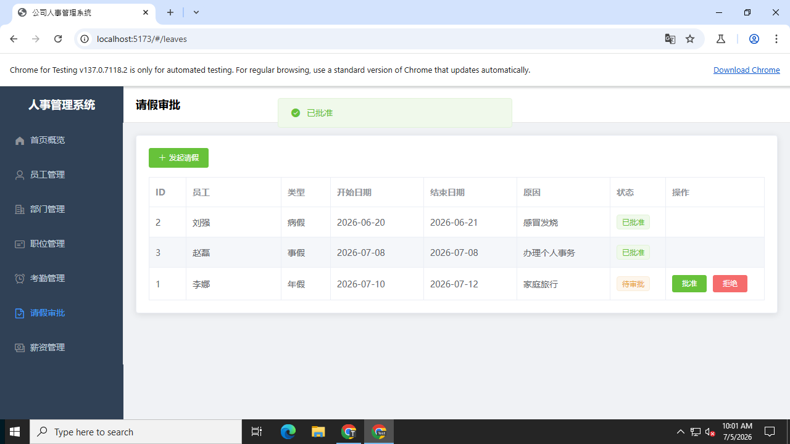
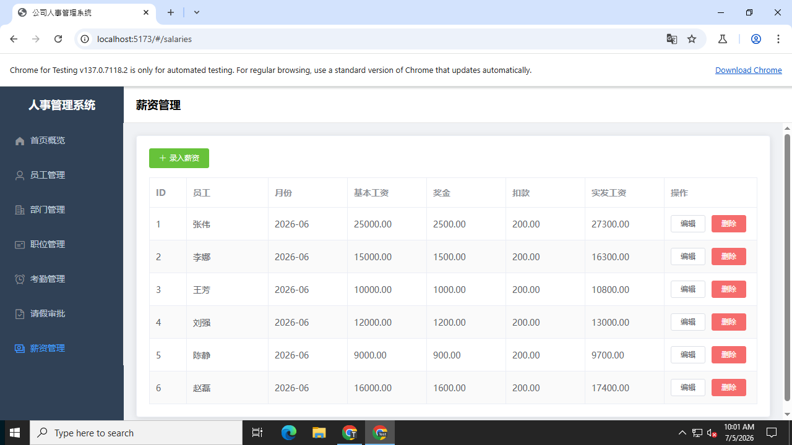

# 人事管理系统功能测试报告

环境：前端 Vite 开发服务器 http://localhost:5173（Vue 2.7 + Element UI），后端 Django runserver :8000，SQLite。

| 测试 | 结果 | 说明 |
|---|---|---|
| 首页概览统计 | ✅ 通过 | 显示 6 名在职员工、4 个部门、2 条待审批请假及部门人数分布 |
| 员工新增 | ✅ 通过 | 新增「孙悦」（市场部/市场专员）保存成功，列表刷新 |
| 部门管理 | ✅ 通过 | 4 个部门及人数统计正确，市场部人数随新增员工更新为 2 |
| 职位管理 | ✅ 通过 | 5 个职位及所属部门显示正确 |
| 考勤管理 | ✅ 通过 | 考勤记录、迟到/早退标签显示正常 |
| 请假审批 | ✅ 通过 | 点击「批准」后赵磊的事假状态变为已批准 |
| 薪资管理 | ✅ 通过 | 实发工资 = 基本工资 + 奖金 - 扣款，自动计算正确 |

## 截图证据

完整操作过程见随附录屏视频。
